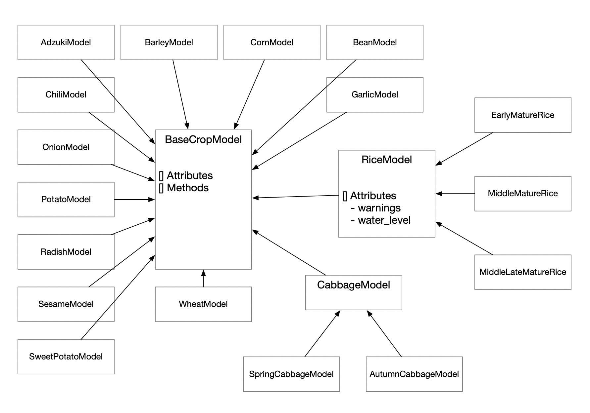

<p align='center'>
    
</p>
# FarmDure

## 개요

GDD 기반 영농관리정보, 기상관측 자료를 통해 특정 기후에서 작물의 재배일정 변화를 테스트할 수 있는 농작물 시뮬레이터
농촌진흥청과 공동개발

### 필요한 데이터 및 코드화
영농관리 필수적인 GDD기반 데이터 코드화
- 작물정보(17가지 작물)
    - 고추, 밀, 보리, 배추(봄배추,가을배추), 옥수수, 고구마, 벼(중만생종, 중새종 조생종), 감자, 마늘, 양파, 무, 참깨, 콩, 팥
- [GDD 계산 방법 보기](./docs/gdd.md)
- YAML 포맷 사용하여 코드화
    - [yaml 코드 보기](./farmdurecore/parameters.yaml)

기상관측자료 DB 구축 및 다운로드 웹서비스 개발
- 기상 정보 수집 및 DB화
- 과거관측자료: 1991년~2020년
- 미래예측자료: 2030년~2069년
- 웹 페이지: http://farmdure.notesquare.co.kr/

## Requirement & Dependency
    numpy == 1.24.*
    polars == 0.18.*
    pyyaml == 6.*

## 설치 방법
### PyPI
    pip install farmdure
### 소스코드
    git clone https://github.com/notesquare/drd-agri-cropscheduler.git
    cd drd-agri-cropscheduler
    python -m pip install .

## 사용예시
### 작물 모델 목록 보기

```python
from farmdure.crops import CropModels

crop_models = {ModelClass.key: ModelClass for ModelClass in CropModels}
{model.key: model.name for model in crop_models.values()}
```

### 작물 선택 & 기본정보 확인

```python
from farmdure.utils.helper import get_default_crop_params


# Select crop model
crop_key = 'chili'
_crop_model = crop_models[crop_key]
crop_params = get_default_crop_params(crop_key)

# Set default parameter
crop_model = _crop_model()
crop_model.set_parameters(crop_params)

# See how the crop model is designed
crop_model
```

### 시뮬레이션

```python
# Synch weather data to crop model
from farmdure.utils.weather import get_sample_weather_data


sample_weather_data = get_sample_weather_data()  # http://farmdure.notesquare.co.kr/ 에서 원하는 기상자료 다운로드 가능
crop_model.set_weather_data(sample_weather_data)
```

```python
# Setting a starting day of cultivation makes simulation begin
st_doy = 50  #  1 ~ 366
crop_model.set_start_doy(st_doy)

# See the events, schedules, and warnings regarding the crop's life cycle
print(crop_model.events)
print(crop_model.schedules)
print(crop_model.warnings)
```

### 작물 파라미터 변경

```python
# See the list of parameters
crop_model.parameters
```

```python
# Change parameters of the crop
crop_model.update_parameters([
    {
        'type': 'harvest',
        'name': '수확',
        'value': [601, 650],
        'ranged': True,
        'text': '',
        'expose_to': ['events', 'schedules']
    },
    {'type': 'base_temperature', 'value': 10},
    {'type': 'gdd_method', 'value': 'm3'}
])
```

## API
#### class farmdurecore.crops.BaseCropModel(id=None)
기본 작물 모델.
기상 데이터, 작물 모델 파라미터를 입력하여 생육과정을 시뮬레이션 하기 위한 객체.
* Parameters
    - id: string
    작물 모델 식별을 위한 식별자

* Attributes
    - id
    - growth: object
    전체 재배기간 정보
    - parameters: [object]
    작물 모델의 파라미터.
    파라미터에 대한 상세한 설명은 아래 "yaml 파일 작성 요령" 중
    "GDD 값 기준 파라미터 예시 및 작성 요령" 와 "날짜 기준 파라미터 예시 및 작성 요령" 을 참조.

    - attribute: object
    작물 모델의 속성.
    key, allow_multiple_cropping, id, name, type, color 의 정보를 제공하며
    각각 작물키, 다회작 가능여부, 부여된 식별자, 작물 이름, 작물 종, 작물 대표색을 의미함.
    - events: [object]
    작물 모델의 시뮬레이션 결과로 도출된 생육과정의 리스트.
    각 생육과정은 type, name, doy, text, doy의 정보를 가지며,
    doy는 생육과정의 날짜를 나타내고 나머지 항목들은 작물 모델 파라미터의 그것과 동일
    - schedules: [object]
    작물 모델의 시뮬레이션 결과로 도출된 농작업 일정의 리스트.
    각 농작업 일정은 type, name, doy, text, doy의 정보를 가지며,
    doy는 생육과정의 날짜를 나타내고 나머지 항목들은 작물 모델 파라미터의 그것과 동일
    - warnings: [object]
    작물 모델의 시뮬레이션 결과로 도출된 경고 리스트.
    각 경고 정보는 title, type, message 의 정보를 가지며 이들은 모두 문자열 타입임
    - water_level: [object]
    작물 모델의 시뮬레이션 결과로 도출된 관개 정보 리스트.
    각 관개 정보 doy, waterLevel 의 정보를 가지며 doy는 1부터 366까지의 숫자인 1년 중의 날짜를 가리키며
    waterLevel은 수위를 cm 단위로 표시함.

* Methods
    - set_parameters(parameters)
    작물 모델의 파라미터를 결정함.
    parameters는 상기 "Attributes" 항목의 것과 동일.
    - update_parameters(parameters)
    작물 모델의 파라미터 중 일부를 갱신함.
    parameters는 상기 "Attributes" 항목의 것과 동일하며
    업데이트 대상 parameter 는 type 과 name 의 동일성을 기준으로 선택함
    - set_weather_data(weather_df)
    작물 모델의 시뮬레이션에 필요한 기상데이터.
    기상데이터는 farmdure.utils.weather 모듈의 get_sample_weather_data 함수로 획득하거나
    http://farmdure.notesquare.co.kr/ 에서 원하는 획득 가능
    - set_start_doy(start_doy=None)
    작물 모델의 재배 시작일로 파종일 또는 정식일인 경우가 일반적임.
    start_doy가 주어지지 않을 경우 작물 모델의 기본 재배시작일을 사용함.
    해당 메써드를 호출함으로써 시뮬레이션을 수행할 수 있음.

#### 전체 작물 모델 상속 관계


## 사용예시 (고급)


### yaml 파일 작성 요령
#### 작물 정보의 구성
```yaml
springCabbage:                      # 작물키
  start_doy: 51                     # 재배시작일 기본값
  gdd_method: m2                    # GDD 계산방식 (m1, m2, m3 중 택일)
  base_temperature: 5               # 기준온도
  max_dev_temperature: 35           # 최대 생육 온도 (GDD 계산식 m2, m3 에서 사용)
  growth_gdd_rule:                  # front-end 구성시 사용
    ref: harvest

  first_priority_hyperparams: []    # 우선 계산필요한 파라미터 리스트
  gdd_hyperparams: []               # GDD 값을 기준으로 계산하는 파라미터 리스트
  doy_hyperparams: []               # 날짜를 기준으로 계산하는 파라미터 리스트
  warning_hyperparams: []           # 경고 여부 판단 조건 파라미터 리스트
```
* 작물키
    - 작물 모델을 정의하고 검색, 선택 등에 사용되는 주요 값
* start_doy
    - 생육과정 시뮬레이션의 시작일 기본값
    - 작물의 일반적인 파종일, 또는 정식일로 설정
    - 1 ~ 366 의 정수값
    - CropModel의 set_start_doy 메써드 호출시 입력값이 주어지지 않으면 해당값을 사용함
* base_temperature: 기준온도
* max_dev_temperature
    - 최대 생육 온도
    - GDD 계산식 m2, m3에서 사용되는 값 [[docs/gdd.md 참고](./docs/gdd.md)]


#### GDD 값 기준 파라미터 예시 및 작성 요령
```yaml
gdd_hyperparams:
    -
        type: transplant
        name: 이앙
        value: 0
        text: ''
        expose_to: [events, schedules]
    -
        type: harvest
        name: 풋과실 수확
        value: [1330, 1510]
        ranged: True
        text: ''
        expose_to: [events]
    -
        type: harvest
        name: 완숙 수확
        value: 1710
        ranged: True
        period: 20
        text: ''
        expose_to: [events]
```
* type
    - 생육과정을 표현할 수 있는 문자열
    - 임의의 값을 사용가능하나 sow, transplant, bloom, harvest 와 같이 어느 정도 정형화하여 사용할 것을 권장
    - type과 name이 동시에 동일한 파라미터는 동일한 파라미터로 취급됨
* name
    - 생육과정을 표현할 수 있는 문자열, 사람에게 표시하는 것을 목적으로 함
    - 임의의 값을 사용가능
    - type과 name이 동시에 동일한 파라미터는 동일한 파라미터로 취급됨
* value
    - 생육과정 도달에 필요한 GDD 값
* ranged
    - 생육과정이 기간에 해당하는 지 여부. boolean
    - 해당값이 true인 경우, value 값이 길이 2인 리스트이거나 period 값이 존재하여야 함
* period
    - 생육과정이 기간에 해당할 경우 그 기간의 길이를 제한하기 위한 값
    - ranged 값이 true일 것이 전제됨
    - value 값이 길이 2인 리스트일 경우, period는 기간의 최대값을 정의하고 생육과정의 길이는 해당값을 넘지 못함
    - value 값이 수(number)일 경우, period는 기간의 최소값을 정의하고 생육과정의 길이는 항상 해당값을 넘음
* text
    - 생육과정에 대한 설명, 사람에게 표시하는 것을 목적으로 함
* expose_to
    - 해당 생육과정을 표시할 카테고리
    - events, schedules 중 다수를 선택하거나 아무것도 선택하지 않을 수 있음

#### 날짜 기준 파라미터 예시 및 작성 요령
```yaml
doy_hyperparams:
    -
        type: sow
        name: 파종
        ref: [transplant]
        value: [-25]
        text: ''
        expose_to: [events, schedules]
    -
        type: fertilize
        name: 기비
        ref: [transplant, transplant]
        value: [-5, -4]
        text: 인산 비료의 경우 기비시 전량 시비합니다
        expose_to: [schedules]
    -
        type: irragation
        name: 배동받이때(유수형성기)
        ref: [heading, heading]
        value: [-20, 0]
        index: [0, 0]
        water_level: [5, 10]
        expose_to: [water_level]
```
* type, name, expose_to
    - GDD 값 기준 파라미터의 항목과 동일한 역할을 함
    - expose_to 는 추가적으로 "water_level" 옵션을 사용할 수 있으나 [water_level] 과 같이 단일 옵션으로만 사용가능함
    해당 옵션은 관개 정보를 표시하는 기능을 함
* ref, value
    - ref 와 value 는 서로 길이가 동일한 리스트여야 함
    - ref 는 날짜 계산의 기준이고 value 는 기준일로부터의 일수 차이
    - 위 예에서 파종은 정식 25일 전, 기비는 정식 5일전 ~ 정식 4일전
* index
    - index 는 날짜 계산의 기준이 기간일 경우 기간의 시작일과 종류일 중 하나를 선택하는 역할을 함
    - index 값이 0 이면 시작일, 1이면 종료일을 가리킴
    - 위 예에서 배동받이때는 출수(heading) 시작 20일 전 ~ 출수 시작일 까지,
* water_level
    - expose_to: [water_level] 일 때 사용되는 항목으로 수위를 표시함
    - 위 예에서 배동받이때의 수위는 시작일 기준 5cm, 종류일 기준 10cm 임
####  우선 계산이 필요한 파라미터 예시 및 작성 요령
```yaml
first_priority_hyperparams:
    -
        method: GDD
        type: sow
        name: 파종
    -
        method: GDD
        type: silking
        name: 출사
```
* 설명
    - 우선 계산이 필요한 파라미터의 목록으로 시뮬레이션 시 내부적으로 먼저 계산됨
    - 우선 계산의 필요성은 특정 파라미터가 다른 파라미터로부터 참고되는 경우 발생하며 현재 버전(v0.1)에서는 날짜 기준 파라미터에서만 다른 파라미터를 참고하는 것이 가능함
    - 여러 파라미터의 항목중 ref에 기재된 파라미터들이 우선 계산되어야 할 파라미터들임
* method
    - 참조 받는 파라미터가 GDD 기준으로 계산되어야 하는 것이면 "GDD", 날짜 기준으로 계산되어야 하는 것이면 "DOY"로 기재
* type, name
    - 참조 받는 파라미터의 type과 name

#### 경고 파라미터 예시 및 작성 요령
```yaml
  warning_hyperparams:
    -
        method: temperature_and_exposure
        high_extrema_temperature: 45
        high_extrema_exposure_days: 5
        low_extrema_temperature: 10
        low_extrema_exposure_days: 30
    -
        method: milestone_and_temperature_condition
        milestone:
            ref: [harvest, harvest]
            value: [-120, 60]
        condition:
            variable: tmax
            temperature: 25
            operator: ge
        warning_data:
            title: 수확량 감소
            type: 생육 정지 주의
            message: '쪽 분화 ~ 수확 전 25℃ 이상에서 생육이 정지됨'
    -
        method: milestone_length_condition
        milestone:
            ref: [transplant, harvest]
            index: [null, 0]
            value: [0, 0]
        condition:
            length: 75
            operator: ge
        warning_data:
            title: 재배가능성 낮음
            type: 재배불가능
            message: '최대 생육기간 75일 이상입니다.'
```
* 설명
    - 경고 파라미터는 특정 조건을 만족할 경우 경작시 주의가 필요함을 표시하기 위한 정보임
    - method 항목에 해당 경고의 작동방식 데이터를 갖고 있으며 method의 값에 따라 항목의 종류가 변하게 됨
    - method 가 temperature_and_exposure 인 경고는 극한의 온도에 일정한 일수 이상 노출되는 것을 의미하고 각 항목을 아래와 같이 해석함
        - high_extrema_temperature의 온도를 초과하는 날이 high_extrema_exposure_days 이상
        - low_extrema_temperature의 온도 미만의 날이 low_extrema_exposure_days 이상
    - method 가 milestone_and_temperature_condition 인 경고는 특정 생육과정 중 일정한 온도에서 벗어날 경우를 의미하고 각 항목을 아래와 같이 해석함
        - milestone 의 기간 중 condition이 충족될 경우 warning_data를 표시
        - 상기예에서는 수확일 120일 전부터 수확일 60일 후의 기간 중 최고기온이 25도 이상인 경우 수확량 감소에 주의하여야 함을 알릴 수 있음
    - method 가 milestone_length_condition 인 경고는 특정 생육과정이 일정한 기간 동안 지속하지 못하는 경우를 의미하고 각 항목을 아래와 같이 해석함
        - milestone 의 기간 중 condition이 충족될 경우 warning_data를 표시
        - 상기예에서는 정식일부터 수확기 시작일까지의 기간이 75일 이상일 경우 재배가능성이 낮음을 알릴 수 있음

* method
    - 참조 받는 파라미터가 GDD 기준으로 계산되어야 하는 것이면 "GDD", 날짜 기준으로 계산되어야 하는 것이면 "DOY"로 기재
* type, name
    - 참조 받는 파라미터의 type과 name


### 나만의 작물 추가하기

```python
from farmdurecore.crops.base import BaseCropModel


class HorseradishModel(BaseCropModel):
    name = '고추냉이'
    _type = 'horseradish'
    color = '#a5cc53'
    key = 'horseradish'


crop_model = HorseradishModel()

```
```yaml
horseradish:
  start_doy: 300
  gdd_method: m2
  base_temperature: 5
  max_dev_temperature: 35
  growth_gdd_rule:
    ref: harvest

  first_priority_hyperparams: []
  gdd_hyperparams:
    -
        type: sow
        name: 파종
        value: 0
        text: ''
        expose_to: [events, schedules]
    -
        type: transplant
        name: 정식
        value: 600
        text: '잎을 2~3개만 남기고 정식하면 활착이 빨라집니다.'
        expose_to: [events, schedules]
    -
        type: harvest
        name: 수확
        value: 4000
        text: ''
        expose_to: [events, schedules]

  doy_hyperparams: []
  warning_hyperparams:
    -   method: temperature_and_exposure
        high_extrema_temperature: 25
        high_extrema_exposure_days: 5
        low_extrema_temperature: -3
        low_extrema_exposure_days: 5

```
```python
import yaml


PATH_TO_YOUR_CUSTOM_YAML = 'custom_parameters.yaml'

with open(PATH_TO_YOUR_CUSTOM_YAML, 'r', encoding='utf-8') as f:
    custom_params = yaml.load(
        f,
        Loader=yaml.FullLoader
    )

# Select crop model
crop_key = 'horseradish'
custom_crop_params = custom_params[crop_key]

# Set custom parameter
crop_model.set_parameters(custom_crop_params)
crop_model
```


## 버전
#### Ver. 0.0.1 (2023-07-19)
- First release.