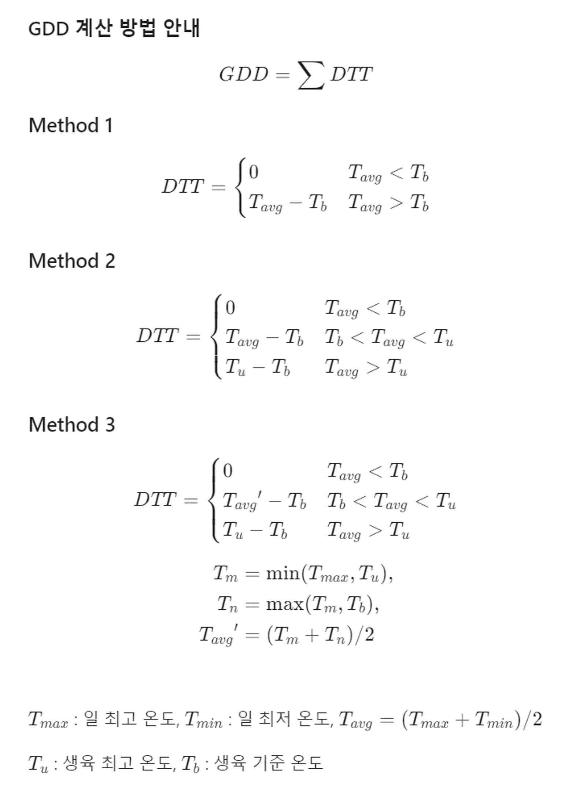

# GDD(Growing Degree Day)

## 개요
유효적산온도라고 하며 작물의 생육 가능온도를 적산한 값이다. 작물이 성숙할 수 있는 시기를 예측하거나 특정 해충이 나타나 손상을 일으킬 수 있는 시기를 예측하여 많은 농업 응용 분야에 유용하게 사용된다.

적산온도 혹은 생장도일(Growing Degree Day, GDD)은 작물이 발아부터 성숙까지 생육단계에 따라서 어느 일정량의 열량을 얻어야 비로소 성숙된다는 생각에서 출발한 것으로 작물의 개화시기, 성숙기 등과 같은 생물계절(phenology)을 예측하기위해 사용할 수 있는 온도적산 값이다.
일반적으로 적산온도(생장도일)는 일최고온도와 일최저온도의 평균값과 기준온도와의 차이의 합으로 계산되며 일평균온도가 기준온도보다 낮으면 적산온도(생장도일)는 0으로 계산한다.
기준온도는 생육에 필요한 한계온도로 작물의 종류에 따라 다르다.

## GDD 계산방법

참고자료
*McMaster, G. S. & Wilhelm, W. Growing degree-days: one equation, two interpretations. Agricultural and Forest Meteorology 87, 291–300 (1997)*

## GDD Data

### 고추

|작물일정|날짜|GDD(℃)|최대일수|TEXT|
|---|---|---|---|---|
|파종|2.10|||정식 65일 이전|
|기비|3.26~4.2|||정식 14 ~ 21일 전 흙갈이 하기, 2 ~ 3주전 석회, 붕소, 비료 시용|
|   |4.9 |||정식 7일 전이랑 만들기, 7일 전 화학 비료 시용|
|정식| 4.16| 0|
|개화| 5.2 ~ 8.8| 150 ~ 1950|
|추비 1차| 5.11 ~ 5.16||| 정식 25~30일 후|
|풋고추 수확| 5.30~ 6.28| 550 ~ 1070| 30일|
|추비 2회| 6.5 ~ 6.15 |||1차 추비 25~30일 후|
|추비 3회| 6.30~7.15 |||2차 추비 25~30일 후|
|붉은고추 수확| 6.29~9.17 |1085 ~ 2730| 80일|
 
- GDD 계산 방법: Method 2
- GDD 기준 온도: 5℃, 적온: 20~30℃, 최저온도: 10~15℃, 최고온도: 35℃
- 고온 장해: 개화전 13~17일 평균기온 30℃ 이상에서 이상화분 발생

- 비료
    * 기비
        - 석회, 붕소 – 정식 2~3주 전 (흙 갈이 하기 2~3주 전)
        - 화학비료 – 정식 7일 전 (이랑 만들기 7일전)
  
    * 추비 1회: 정식 25~30일 후

    * 추비 2회: 1차 추비 후 25~30일 후

    * 추비 3회: 2차 추비 후 25~30일 후
- 재배가능 규칙
    * 고온해: 생육한계 최고온도 40℃ 이상 5일 이상 지속
        - “고온해 위험: 생육한계 최고온도 40℃에 연속 5일 초과되어 노출되었습니다.”  
    * 동해: 생육한계 최저온도 10℃ 미만 5일 이상 지속
        - “동해 위험: 생육한계 최저온도 10℃에 연속 5일 초과되어 노출되었습니다.”  
    * 이상화분 발생: 개화전 13~17일 평균기온 30℃ 이상
        - “이상화분 발생 주의: 30℃이상에서 화분의 수정능력 저하”

### 밀

|작물일정|날짜|GDD(℃)|최대일수|TEXT|
|---|---|---|---|---|
|파종|10.11|0|
|생육재생기|2.11 ~ 2.27|-|30|
|분얼 및 신장|2.27~4.14|601 ~ 970|50|
|출수|4.15 ~ 5.5|975 ~ 1280|30|
|등숙|5.5 ~ 5.26|1280 ~ 1665|30|
|수확|5.27 ~7.6|1671 ~ 2595|40|
 
- GDD 계산 방법: Method 2
- GDD 기준 온도: 0℃, 최저 생육온도: 3~4℃, 적온: 25℃, 최고온도: 30~32℃ 2
- 개화: 출수 후 3~7일, 개화일수 2~7일
- 개화 최적 온도 18~21℃, 최저 10~13℃, 최고 31~32℃
- 월동기: 평균기온 0℃ 이하 일 때 생육정지, 월동기 시작
- 생육재생기 평균기온이 0℃ 이상 지속적으로 올라갈 때

- 비료
    - 기비:
        - 파종 한달 전 시용
        - 인산, 칼리 전량 시용, 질소 50% 시용  

    - 추비 1차: 생육재생 직 후

    - 추비 2차: 1차 20일 후
- 재배가능 규칙
    - 고온해: 생육 최고온도 32℃ 초과 5일 이상 지속
        - “고온해 위험: 생육한계 최고온도 32℃에 연속 5일 초과되어 노출되었습니다.”  
    - 동해: 생육 최저온도 3℃ 미만 5일 이상 지속
        - “동해 위험: 생육한계 최저온도 3℃에 연속 5일 초과되어 노출되었습니다.”  
    - 월동기 동해: -25℃ 이하 12월 21부터 2월 10일까지, 생육정지기
        - “월동기 동해 위험: 월동기 동해 온도 -25℃ 이하입니다.”  
    - 월동기 동해: -6℃ 이하 2월 10일부터 3월 10일까지, 생육재생기
        - “월동기 동해 위험: 월동기 동해 온도 -6℃ 이하입니다.”  
    - 분얼 및 신장 불가: 12월 21일부터 2월 상순
        - 생육정지기 이므로 분얼 및 신장이 불가합니다.

### 보리

|작물일정|날짜|GDD(℃)|최대일수|TEXT|
|---|---|---|---|---|
|파종|10.17|0|
|생육재생기|2.11 ~ 3.2|-|30일|
|분얼 및 신장|3.2 ~ 4.14|525 ~ 885|50일|
|출수|4.15 ~ 5.6|896 ~ 1200|30일|
|등숙|5.6 ~ 5.27|1200 ~ 1600|40일|
|수확|5.27 ~ 6.27|1600 ~ 2295|40일|
 
- GDD 계산 방법: Method 2
- GDD 기준 온도: 0℃, 최저 생육온도: 3~4.5℃, 최적온도: 20℃, 최고온도: 28~30℃
- 출수와 동시에 개화 수분, 개화적온: 18~21℃
- 월동기: 평균기온 0℃ 이하 일 때 생육정지, 월동기 시작
- 생육재생기 평균기온이 0℃ 이상 지속적으로 올라갈 때

- 비료
    - 기비: 인산, 칼리, 퇴비는 전량 시용, 질소는 50% 시용

    - 추비 1차: 생육재생기 직후

    - 추비 2차: 1차 추비 20일 후

    - 질소비료 추비 시 나누어서 시용
 
- 재배가능 규칙
    - 고온해: 생육 최고온도 30℃ 초과 5일 이상 지속
        - “고온해 위험: 생육한계 최고온도 30℃에 연속 5일 초과되어 노출되었습니다.”  
    - 동해: 생육 최저온도 3℃ 미만 5일 이상 지속
        - “동해 위험: 생육한계 최저온도 3℃에 연속 5일 초과되어 노출되었습니다.”  
    - 월동기 동해: -17℃ 이하 12월 21일 부터 2월 10일 상순, 생육정지기
        - “월동기 동해 위험: 월동기 동해 온도 -17℃ 이하입니다.”  
    - 월동기 동해: -6℃ 이하 2월 10일부터 3월 10일까지, 생육재생기
        - “월동기 동해 위험: 월동기 동해 온도 -6℃ 이하입니다.”  
    - 분얼 및 신장 불가: 12월 21일부터 2월 10일까지
        - 생육정지기 이므로 분얼 및 신장이 불가합니다.

### 배추

#### 봄배추

|작물일정|날짜|GDD(℃)|최대일수|TEXT|
|---|---|---|---|---|
|파종|1.21|||정식 30일 이전|
|기비|2.13|||정식 7일 전|
|정식|2.20|0|
|추비 1차|3.7|||정식 15일 후|
|추비 2차|3.22|||정식 30일 후|
|추비 3차|4.6|||정식 45일 후|
|결구|5.6 ~ 5.18|370 ~ 525|30일|
|수확|5.21~5.31|601|15일|
 
- GDD 계산 방법: Method 2
- GDD 기준 온도: 5℃, 최저온도: 4~5℃, 생육적온: 18~25℃, 최고온도: 30℃
- 최대 수확 GDD 601℃ 오류! 책갈피가 정의되어 있지 않습니다.

- 비료
    - 기비: 정식 7일전

    - 추비1회: 정식 후 15일

    - 추비2회: 정식 후 30일

    - 추비3회: 정식 후 45일
 
- 재배가능 규칙
    - 정식에서부터 수확일이 45일 ~ 75일 사이에 위치
        - “재배 불가능: 최소 생육기간 45일 이하입니다.”
        - “재배 불가능: 최대 생육기간 75일 이상입니다.”  
    - 고온해: 생육한계 최고온도 30℃가 5일 이상 지속
        - “고온해 위험: 생육한계 최고온도 30℃에 연속 5일 초과되어 노출되었습니다.”  
    - 동해: 생육한계 최저온도 5℃가 5일 이상 지속
        - “동해 위험: 생육한계 최저온도 5℃에 연속 5일 초과되어 노출되었습니다.”

#### 가을배추

|작물일정|날짜|GDD(℃)|최대일수|TEXT|
|---|---|---|---|---|
|파종|8.3|||정식 30일 이전|
|기비|8.26|||정식 7일 전|
|정식|9.2|0|
|추비 1차|9.17|||정식 15일 후|
|추비 2차|10.2||| 30일 후|
|결구|10.4 ~ 10.25|505 ~ 725|30일|
|추비 3차|10.17|||정식 45일 후|
|수확|10.25~11.24|725 ~ 870|30일|
 
- GDD 계산 방법: Method2
- GDD 기준 온도 5℃, 최저온도 4~5℃, 생육적온 18~25℃, 최고온도 30℃

- 비료
    - 기비: 정식 7일전

    - 추비1회: 정식 후 15일

    - 추비2회: 정식 후 30일

    - 추비3회: 정식 후 45일
 
- 재배가능 규칙
    - 정식에서부터 수확일이 45일 ~ 75일 사이에 위치
        - “재배 불가능: 최소 생육기간 45일 이하입니다.”
        - “재배 불가능: 최대 생육기간 75일 이상입니다.”  
    - 고온해: 생육한계 최고온도 30℃가 5일 이상 지속
        - “고온해 위험: 생육한계 최고온도 30℃에 연속 5일 초과되어 노출되었습니다.”  
    - 동해: 생육한계 최저온도 5℃가 5일 이상 지속
        - “동해 위험: 생육한계 최저온도 5℃에 연속 5일 초과되어 노출되었습니다.”

### 옥수수

|작물일정|날짜|GDD(℃)|최대일수|TEXT|
|---|---|---|---|---|
|기비|3.7~3.22|||파종 15~30일 전|
|파종|4.6|0|
|추비 1회|5.6~5.16|||파종 30일 후 7~8 엽기에 추비|
|출웅|6.12~6.27|||출사 시작 7일 전~출사 종료 6일 전|
|추비 2회|6.15|||파종 70일 후 옥수수꽃 나왔을 때|
|출사|6.19~7.3|1049|14일|
|수확|7.9~7.19|1400|10일|
 
- GDD 계산 방법 Method 2
- GDD 기준 온도 10℃, 생육적온 25~30℃, 생육 장해 온도 10℃이하, 45℃이상
- 파종-등숙 GDD 1747℃
- 고온 장해: 출웅기(출사전 6~7일) 35℃ 초과 임실률 감소

- 비료
    - 기비: 파종 15~30일

    - 추비 1회: 파종 후 30~40일(잎이 7~8장, 키가 성인 무릎정도)

    - 추비 2회: 파종 후 70일(옥수수 꽃이 나왔을 때)
 
- 재배가능 규칙
    - 고온해: 생육한계 최고온도 45℃ 초과 5일 이상 지속
        ▪ “고온해 위험: 생육한계 최고온도 45℃에 연속 5일 초과되어 노출되었습니다.”  
    - 동해: 생육한계 최저온도 10℃ 미만 5일 이상 지속
        ▪ “동해 위험: 생육한계 최저온도 10℃에 연속 5일 초과되어 노출되었습니다.  
    - 임실률 감소: 출웅기(출사전 6~7일) 35℃ 초과
        ▪ “임실률 감소 주의: 35℃초과 온도에 노출되었습니다. 임실률이 감소할 수 있습니다.”

### 고구마

|작물일정|날짜|GDD(℃)|최대일수|TEXT|
|---|---|---|---|---|
|기비|3.9 ~ 3.10|||파종 2~3일 전 전량 시용|
|파종|3.11|||삽식 60일 전|
|퇴비|4.20 ~ 4.27|||삽식 14~21일 전|
|삽식|5.10|0|
|수확|8.26~9.9|1600|15일|
 
- GDD 계산 방법: Method3
- GDD 기준 온도 15.5℃, 최저온도 15℃, 생육적온 20~30℃, 최고온도 32.2℃
- 삽식(5월 21일)-수확(9월 17일) GDD 1462℃
- GDD 2028℃
- 수확기: 삽식 후 110~120일

- 비료
    - 퇴비: 삽식 2~3주 전 살포 후 경운

    - 기비: 파종 2~3일 전 전량 시용
 
- 재배가능 규칙
    - 고온해: 생육한계 최고온도 32.2℃ 초과 5일 이상 지속
        - “고온해 위험: 생육한계 최고온도 32℃에 연속 5일 초과되어 노출되었습니다.”  
    - 동해: 생육한계 최저온도 15℃ 미만 5일 이상 지속
        - “동해 위험: 생육한계 최저온도 15℃에 연속 5일 초과되어 노출되었습니다.”

### 벼

#### 중만생종

|작물일정|날짜|GDD(℃)|최대일수|TEXT|
|---|---|---|---|---|
|파종|5.20|||이앙 25일 이전|
|기비|6.9~6.10|||이안 4~5일 전
|이앙|6.14|0|
|수비|7.15 ~ 7.29|625 ~ 1215|
|출수|8.9 ~ 8.23|1404|14일|
|수확|10.16~10.26|2600|10일|
 
- GDD 계산 방법: Method 3
- GDD 기준 온도 8℃, 이앙-출수 1404℃, 이앙-등숙기 2111℃
- 파종시기

- 비료
    - 기비: 이앙 4~5일 전 – 인산 비료의 경우 전량 시비

    - 분얼비: 이앙 후 12일 – 질소, 칼리 비율 기비70% 수비30%을 할 경우 분얼비 생략가능

    - 수비: 출수 25일 전
 
- 재배가능 규칙
    - 고온해: 생육한계 최고온도 40℃이상 5일 이상 지속
        - “고온해 위험: 생육한계 최고온도 40℃에 연속 5일 초과되어 노출되었습니다.”  
    - 동해: 생육한계 최저온도 12℃이하 5일 이상 지속
        - “동해 위험: 생육한계 최저온도 12℃에 연속 5일 초과되어 노출되었습니다.”  
    - 안전 출수기: 출수기 이후 40일 평균기온 21~24도, 최적 출수기 22.5도
        - “출수 주의: 안전 출수기 적정온도 21℃ 미만입니다. 수확량이 감소할 수 있습니다.”
        - “출수 주의: 안전 출수기 적정온도 24℃ 초과입니다. 수확량이 감소할 수 있습니다.”
        - “출수 위험: “출수기 온도 16℃ 이하입니다. 수확량이 50% 감소할 수 있습니다.”
        - “출수 위험: “출수기 온도 29℃ 이상입니다. 수확량이 50% 감소할 수 있습니다.”

#### 중생종

|작물일정|날짜|GDD(℃)|최대일수|TEXT|
|---|---|---|---|---|
|파종|5.3|||이앙 25일 이전|
|기비|5.23~5.24|||이앙 4~5일 전|
|이앙|5.28|0|
|수비|7.1~7.8|
|출수|7.26~8.2|1330 ~ 1510|20일|
|수확|9.13~9.18|2500~2600|20일|
 
- GDD 계산 방법: Method 3
- GDD 기준 온도 7℃
- 출수, 수확적기

- 비료
    - 기비: 이앙 4~5일 전 – 인산 비료의 경우 전량 시비

    - 분얼비: 이앙 후 12일 – 질소, 칼리 비율 기비70% 수비30%을 할 경우 분얼비 생략가능

    - 수비: 출수 25일 전
 
- 재배가능 규칙
    - 고온해: 생육한계 최고온도 40℃이상 5일 이상 지속
        - “고온해 위험: 생육한계 최고온도 40℃에 연속 5일 초과되어 노출되었습니다.”  
    - 동해: 생육한계 최저온도 12℃이하 5일 이상 지속
        - “동해 위험: 생육한계 최저온도 12℃에 연속 5일 초과되어 노출되었습니다.”  
    - 안전 출수기: 출수기 이후 40일 평균기온 21~24도, 최적 출수기 22.5도
        - “출수 주의: 안전 출수기 적정온도 21℃ 미만입니다. 수확량이 감소할 수 있습니다.”
        - “출수 주의: 안전 출수기 적정온도 24℃ 초과입니다. 수확량이 감소할 수 있습니다.”
        - “출수 위험: “출수기 온도 16℃ 이하입니다. 수확량이 50% 감소할 수 있습니다.”
        - “출수 위험: “출수기 온도 29℃ 이상입니다. 수확량이 50% 감소할 수 있습니다.”

#### 조생종

|작물일정|날짜|GDD(℃)|최대일수|TEXT|
|---|---|---|---|---|
|파종|5.16|||이앙 25일 이전|
|기비|6.5~6.6|||이앙 4일~5일전|
|이앙|6.10|0|
|수비|6.27~7.5|
|출수|7.22~7.30|1000 ~ 1200|20일|
|수확|9.17~9.25|2400~2550|20일|
 
- GDD 계산 방법: Method 3
- GDD 기준 온도 6℃
- 출수, 수확적기

- 비료
    - 기비: 이앙 4~5일 전 – 인산 비료의 경우 전량 시비

    - 분얼비: 이앙 후 12일 – 질소, 칼리 비율 기비70% 수비30%을 할 경우 분얼비 생략가능

    - 수비: 출수 25일 전
 
- 재배가능 규칙
    - 고온해: 생육한계 최고온도 40℃이상 5일 이상 지속
        - “고온해 위험: 생육한계 최고온도 40℃에 연속 5일 초과되어 노출되었습니다.”  
    - 동해: 생육한계 최저온도 12℃이하 5일 이상 지속
        - “동해 위험: 생육한계 최저온도 12℃에 연속 5일 초과되어 노출되었습니다.”  
    - 안전 출수기: 출수기 이후 40일 평균기온 21~24도, 최적 출수기 22.5도
        - “출수 주의: 안전 출수기 적정온도 21℃ 미만입니다. 수확량이 감소할 수 있습니다.”
        - “출수 주의: 안전 출수기 적정온도 24℃ 초과입니다. 수확량이 감소할 수 있습니다.”
        - “출수 위험: “출수기 온도 16℃ 이하입니다. 수확량이 50% 감소할 수 있습니다.”
        - “출수 위험: “출수기 온도 29℃ 이상입니다. 수확량이 50% 감소할 수 있습니다.”

### 감자

|작물일정|날짜|GDD(℃)|최대일수|TEXT|
|---|---|---|---|---|
|파종|3.6|0|
|정식|3.28 ~ 4.6|55 ~ 110|20일|
|덩이줄기 비대기|5.6 ~ 5.25|||정식 종료 30일 후 ~ 수확시작 10일 전|
|수확|6.4 ~ 6.14|875|10일|
 
- GDD 계산 방법: Method 2
- GDD 기준 온도 4.5℃, 재배적온 15~20℃, 최저온도 0~4℃, 최고온도 35℃
- 정식날짜
- 고온피해: 27~30℃이상 덩이줄기 비대 정지

- 파종-성숙 GDD 875℃
 
- 재배가능 규칙
    - 고온해: 생육한계 최고온도 35℃ 초과 5일 이상 지속
        - “고온해 위험: 생육한계 최고온도 35℃에 연속 5일 초과되어 노출되었습니다.”  
    - 동해: 생육한계 최저온도 0℃ 미만 5일 이상 지속
        - “동해 위험: 생육한계 최저온도 0℃에 연속 5일 초과되어 노출되었습니다.”  
    - 덩이줄기 비대 정지: 27~30℃이상
        - “덩이줄기 비대 정지 주의: 30℃이상 온도에 노출되었습니다. 덩이줄기 비대가 정지될 수 있습니다.”

### 마늘

|작물일정|날짜|GDD(℃)|최대일수|TEXT|
|---|---|---|---|---|
|파종|9.26|0|
|추비|2.21~3.20|-|
|수확|6.5~6.15|1000|10일|
 
- GDD 계산 방법: Method 2
- GDD 기준 온도 7.1℃, 생육적온 18~20℃, 최고온도 25℃, 최저온도 10이하
- 고온 피해: 쪽 분화-수확전 25℃ 이상에서 생육정지
- 수확기 GDD 1000℃
- 월동기: 파종 40일 후

- 구비대기: 수확 50일전
 
- 재배가능 규칙
    - 고온해: 생육한계 최고온도 25℃ 초과 5일 이상 지속
        - “고온해 위험: 생육한계 최고온도 25℃에 연속 5일 초과되어 노출되었습니다.”  
    - 동해: 생육한계 최저온도 10℃ 미만 5일 이상 지속
        - “동해 위험: 생육한계 최저온도 10℃에 연속 5일 초과되어 노출되었습니다.”  
    - 월동기 동해: -8℃ 이하 11월 중순부터 1월 중순까지
        - “월동기 동해 위험: 월동기 동해 온도 -8℃ 이하입니다.”

### 양파

|작물일정|날짜|GDD(℃)|최대일수|TEXT|
|---|---|---|---|---|
|파종|8,26|0|
|정식|10.15 ~ 11.24|790 ~ 1050|40일|
|추비 1회|2.11 ~ 3.10|-|
|추비 2회|3.11 ~ 4.10|-|
|구 비대기|5.8 ~ 5.21|||수확시작 40일 전 ~ 수확종료 40일 전|
|수확|6.17 ~ 6.30|2092 ~ 2352|30일|
 
- GDD 계산 방법: Method 2
- GDD 기준 온도 4.5℃, 생육적온 15℃, 최고온도 25℃, 최저온도 4℃
- 정식-수확 GDD 1302℃
- 온도
    - 발아 적온 15~25℃, 발아 최고온도 33℃, 발아 최저온도 4℃

    - 정식기간온도(활착온도) 생육적온 30℃, 최저온도 4℃

    - 고온 피해: 구비대기에 25℃ 초과에서 생육둔화

- 발아기간: 파종부터 정식 전
- 구비대기: 수확 40일 전

- 비료
    - 기비: 정식 30일전

    - 추비 1회: 수확 110일전(구비대기 70일 전)

    - 추비 2회: 추비 1회 30일 후
 
- 재배가능 규칙
    - 고온해(구비대기): 생육한계 최고온도 25℃ 초과 5일 이상 지속
        - “고온해 위험: 생육한계 최고온도 25℃에 연속 5일 초과되어 노출되었습니다.”  
    - 고온해(정식기간): 생육한계 최고온도 30℃ 초과 5일 이상 지속
        - “고온해 위험: 생육한계 최고온도 30℃에 연속 5일 초과되어 노출되었습니다.”  
    - 고온해(발아기간): 생육한계 최고온도 33℃ 초과 5일 이상 지속
        - “고온해 위험: 생육한계 최고온도 33℃에 연속 5일 초과되어 노출되었습니다.”  
    - 동해: 생육한계 최저온도 4℃ 미만 5일 이상 지속
        - “동해 위험: 생육한계 최저온도 4℃에 연속 5일 초과되어 노출되었습니다.”  
    - 월동기 동해: -8℃ 이하 12월 하순부터 2월 상순까지
        - “월동기 동해 위험: 월동기 동해 온도 -8℃ 이하입니다.”

### 무

|작물일정|날짜|GDD(℃)|최대일수|TEXT|
|---|---|---|---|---|
|파종|1.30|0|
|추비 1회|2.19|-|
|추비 2회|3.5|-|
|수확|6.5 ~ 6.15|850|50일|
 
- GDD 계산 방법: Method2
- GDD 기준 온도 5℃, 생육적온15~30℃, 최저온도 4℃, 최고온도 35℃
- 파종~수확 850℃
- 파종 3일 후 발아
- 발아 최적 온도 15~30℃ 발아 최저온도 4℃ 최고 온도 35℃이상

- 비료
    - 기비: 파종 6일전

    - 퇴비와 석회: 파종 30일 전

    - 추비 1회: 파종 후 20일

    - 추비 2회: 1회 후 15일
 
- 재배가능 규칙
    - 고온해: 생육한계 최고온도 35℃ 이상 5일 이상 지속
        - “고온해 위험: 생육한계 최고온도 35℃에 연속 5일 초과되어 노출되었습니다.”  
    - 동해: 생육한계 최저온도 4℃ 이하 5일 이상 지속
        - “동해 위험: 생육한계 최저온도 4℃에 연속 5일 초과되어 노출되었습니다.”

### 참깨

|작물일정|날짜|GDD(℃)|최대일수|TEXT|
|---|---|---|---|---|
|파종|5.6|0|
|개화|5.27 ~ 6.27|410 ~ 1110|30일|
|수확|7.13 ~ 7.23|2700|30일|
 
- GDD 계산 방법: Method 2
- GDD 기준 온도 10℃, 생육적온 25~30℃
- 고온피해: 개화기 40℃ 이상 고온 조기낙화 등숙률 저하
- 수확 GDD 2700℃
- 개화: 파종 후 37~40일 경이 시작 15~30일 동안 지속
- 생육기간: 90~120일

- 비료
    - 기비: 퇴비 살포 후 비료 전량 시용
  
- 재배가능 규칙
    - 고온해: 생육한계 최고온도 30℃ 초과 5일 이상 지속
        - “고온해 위험: 생육한계 최고온도 30℃에 연속 5일 초과되어 노출되었습니다.”  
    - 동해: 생육한계 최저온도 18℃ 미만 5일 이상 지속
        - “동해 위험: 생육한계 최저온도 18℃에 연속 5일 초과되어 노출되었습니다.”  
    - 등숙률 저하: 개화기 40℃ 이상
        - “조기낙화 주의: 40℃ 이상 온도에 노출되었습니다. 등숙률이 저하될 수 있습니다.”

### 콩

|작물일정|날짜|GDD(℃)|최대일수|TEXT|
|---|---|---|---|---|
|파종|6.20|0|
|개화|8.15 ~ 8.30|1450 ~ 1840|20일|
|수확|10.10 ~ 10.20|2500~3000|20일|
 
- GDD 계산 방법: Method 2
- GDD 기준 온도 10℃, 생육적온 25~30℃, 최저온도 20℃, 최고온도 35℃
- 수확 GDD 2500~3000℃
- 발아최저 온도 4℃, 최고 온도 42℃, 적온 25~35℃
- 발아 기간: 파종후 3~5일
- 개화 최적 온도 22~23℃, 최저 온도 17~18℃

- 비료
    - 기비: 파종 2일 전 (전량시용)
  
- 재배가능 규칙
    - 고온해: 생육한계 최고온도 35℃ 초과 5일 이상 지속
        - “고온해 위험: 생육한계 최고온도 35℃에 연속 5일 초과되어 노출되었습니다.”  
    - 동해: 생육한계 최저온도 20℃ 미만 5일 이상 지속
        - “동해 위험: 생육한계 최저온도 20℃에 연속 5일 초과되어 노출되었습니다.”

### 팥

|작물일정|날짜|GDD(℃)|최대일수|TEXT|
|---|---|---|---|---|
|파종|5.26|0|
|개화|7.12 ~ 8.1|850 ~ 1240|20일|
|수확|9.28 ~ 10.8|2300|10일|
 
- GDD 계산 방법: Method 2
- GDD 기준 온도 5℃, 생육적온 20~24℃, 수확 GDD 2300℃
- 개화온도 20~30℃ 최적온도 26℃, 개화 최저온도 16℃ 이하 꼬투리 줄어듬

- 기비: 비료 전량 시용
 
- 재배가능 규칙
    - 고온해: 생육한계 최고온도 30℃ 이상 5일 이상 지속
       - “고온해 위험: 생육한계 최고온도 30℃에 연속 5일 초과되어 노출되었습니다.”  
    - 동해: 생육한계 최저온도 16℃ 이하 5일 이상 지속
        - “동해 위험: 생육한계 최저온도 16℃에 연속 5일 초과되어 노출되었습니다.”
